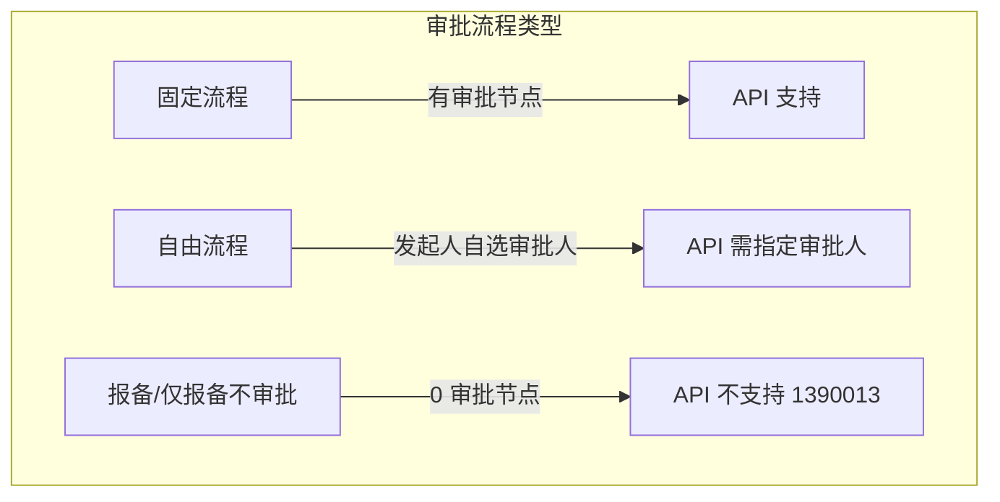

# 飞书 API 自动创建工单的支持条件

## 一、核心结论

飞书 `/approval/v4/instances` 接口**并非支持所有审批类型**。需同时满足**表单控件**和**流程设计**两方面的条件。

---

## 二、支持条件详解

### 1. 表单控件类型

**支持的控件**（可通过 API 传值）：

- 基础：`input`、`textarea`、`number`、`amount`、`date`、`dateInterval`
- 选择：`radio`、`radioV2`、`checkbox`、`checkboxV2`
- 关联：`contact`、`department`、`connect`
- 文件：`attachment`、`attachmentV2`、`image`、`imageV2`
- 其他：`formula`、`fieldList`、`shiftGroup`、`telephone`

**不支持的控件**（含这些控件的审批无法通过 API 创建）：

| 控件        | 类型标识                    |
| --------- | ----------------------- |
| 地址        | address                 |
| 出差控件组     | tripGroup               |
| 请假控件组     | leaveGroup、leaveGroupV2 |
| 加班控件组     | workGroup               |
| 补卡控件组     | remedyGroup             |
| **外出控件组** | **outGroup**            |

### 2. 流程设计类型

- **固定流程**：有预设审批节点和审批人 → **支持**
- **自由流程**：发起人自选审批人 → **支持**，但创建实例时需传入审批人
- **报备单 / 仅报备不审批**：无审批节点，仅登记 → **不支持**，返回 `unsupported approval for free process`（错误码 1390013）

---

## 三、外出报备失败原因

根据错误 `1390013 unsupported approval for free process` 和描述「仅报备不审批」：

| 维度     | 外出报备       | 用印/采购      |
| ------ | ---------- | ---------- |
| 流程类型   | 报备单（无审批节点） | 固定流程（有审批人） |
| API 支持 | 否          | 是          |

外出报备的表单可能只用了 `input`、`textarea`、`date` 等基础控件，但**流程类型为「仅报备不审批」**，因此 API 不支持创建。

---

## 四、如何让审批支持 API 创建

### 方案 A：在管理后台调整流程（推荐）

1. 打开 [飞书审批管理后台](https://www.feishu.cn/approval/admin/approvalList?devMode=on)
2. 编辑「外出报备」
3. 在 **流程设计** 中至少添加一个审批节点（如「自动通过」或指定审批人）
4. 保存并发布

流程从「仅报备」改为「有审批节点」后，API 即可创建实例。

### 方案 B：新建一个「外出申请」审批

- 新建审批定义，使用固定流程
- 表单使用基础控件（单行文本、日期等），**不要使用外出控件组 (outGroup)**
- 配置至少一个审批节点

### 方案 C：继续使用 LINK_ONLY

若必须保持「仅报备不审批」，则无法通过 API 创建，只能保留当前 LINK_ONLY 流程，由用户点击链接手动发起。

---

## 五、项目内可做的优化

1. **在 README 或配置中说明**：哪些审批类型支持 API 创建，哪些需要 LINK_ONLY
2. **在 `approval_types/README.md` 中补充**：新增审批时需确认流程类型和控件类型
3. **可选：增加预检逻辑**：在创建前调用 `GET /approval/v4/approvals/{approval_code}` 获取流程定义，若为 free process 则直接走 LINK_ONLY，避免无效 API 调用

---

## 六、参考资料

- [创建审批实例 - 飞书 API](https://open.feishu.cn/document/uAjLw4CM/ukTMukTMukTM/reference/approval-v4/instance/create)
- [审批接入指南](https://feishu.apifox.cn/doc-1974107)
- 项目内：[approval_types/outbound.py](e:\projects\feishu--admin-bot-main\approval_types\outbound.py)、[approval_types/seal.py](e:\projects\feishu--admin-bot-main\approval_types\seal.py)

